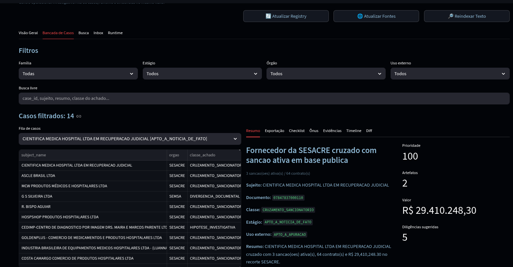
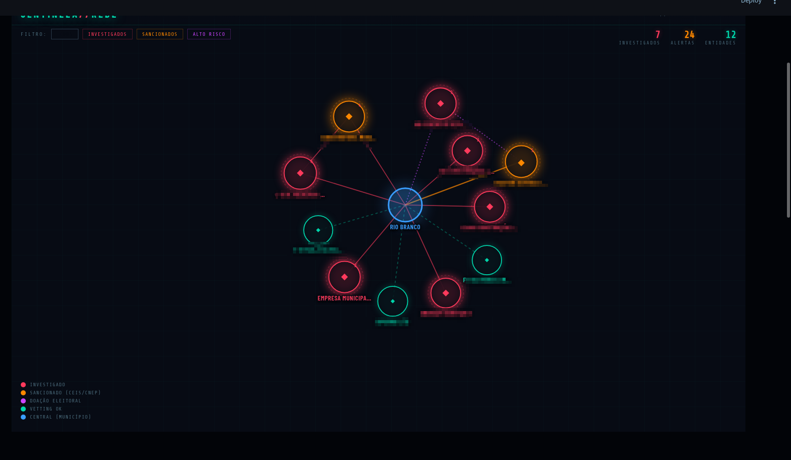
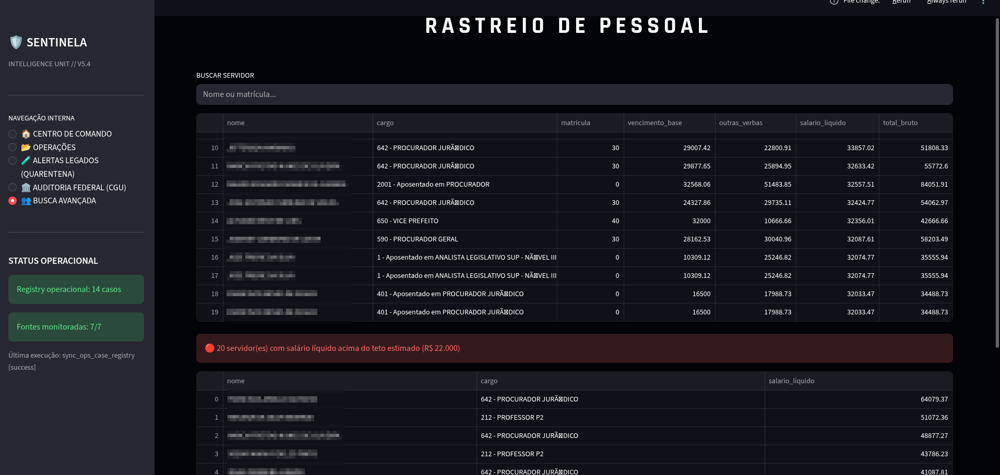

# 🛡️ SENTINELA // COMMAND CENTER

Sistema de inteligência e auditoria de gastos públicos focado no Estado do Acre e Município de Rio Branco. O projeto utiliza **DuckDB** para análise massiva de dados e conformidade probatória.

## 📺 Demonstração do Sistema





## 🚀 Pré-requisitos

- **Python 3.10+**
- **Venv** (ambiente virtual)

---

## 🛠️ Configuração Inicial

1. **Clonar o repositório e entrar na pasta:**
   ```bash
   cd Projetos/Sentinela
   ```

2. **Criar e ativar o ambiente virtual:**
   ```bash
   python3 -m venv .venv
   source .venv/bin/activate
   ```

3. **Instalar dependências:**
   ```bash
   pip install -r requirements.txt
   ```

---

## 🚦 Operação

### Painel Principal (Dashboard)
Interface principal de monitoramento, casos e evidências.
```bash
source .venv/bin/activate
streamlit run app.py
```
*Acesse o painel em: `http://localhost:8501`*

---

## 📂 Camada Operacional (V5)

O Streamlit opera como centro de comando da fila de casos probatórios. Para sincronizar as tabelas operacionais e processar o rastro documental:

```bash
# Sync completo da camada de casos e auditoria
.venv/bin/python scripts/sync_ops_case_registry.py
.venv/bin/python scripts/sync_ops_source_cache.py
.venv/bin/python scripts/sync_ops_inbox.py
.venv/bin/python scripts/sync_ops_timeline.py
.venv/bin/python scripts/sync_ops_search_index.py
.venv/bin/python scripts/sync_ops_burden.py
.venv/bin/python scripts/sync_ops_semantic.py
.venv/bin/python scripts/sync_ops_contradiction.py
.venv/bin/python scripts/sync_ops_checklist.py
.venv/bin/python scripts/sync_ops_guard.py
.venv/bin/python scripts/sync_ops_export_gate.py
```

### Principais Funcionalidades (V5):
- `ops_case_registry`: Registro materializado de casos de alta prioridade.
- `ops_case_burden_item`: Matriz de ônus probatório (o que falta provar).
- `ops_case_generated_export`: Exportações seguras e não-acusatórias.
- `ops_artifact_text_index`: Busca textual em documentos anexados.

---

## 🏗️ Módulos Arquivados / Experimentais

Estes módulos fizeram parte de versões anteriores e estão mantidos para referência histórica ou triagem técnica interna, mas **não são o foco operacional atual**:

- **Neo4j (V1/Experimental):** Mapeamento de grafos de influência (`start_db.sh`, `docker-compose.yml`). Atualmente inativo.
- **Insights Engine (V2/V3):** Motor exploratório (`insights_engine.py`, `scripts/sync_v2.py`). Fica desligado por padrão devido ao alto ruído.
- **Alertas Legados (V1/Quarentena):** Tabela `alerts` e `cross_reference_engine.py`. Mantidos em quarentena técnica no dashboard.

---

## 📡 Ingestão de Dados (Fontes Locais)

Para atualizar as bases brutas do DuckDB:

### 1. Inteligência de Pessoal & Salários
```bash
python3 src/ingest/riobranco_servidores_mass.py
```

### 2. Radar de Obras Públicas
```bash
python3 src/ingest/riobranco_obras_list.py
```

### 3. Rastreio de Diárias
```bash
python3 src/ingest/riobranco_diarias.py
```

---
**AVISO:** Este sistema é para uso em auditoria e controle social. Respeite os termos de uso dos portais de transparência.
